# Crud de uma Biblioteca
Projeto para a faculdade

+ Crud Bibliotecas
+ Crud Atendentes
+ Crud Livros
+ Crud Categorias
+ Crud Reservas
+ Crud Usários

# Sql demo
### Há um sql demo em "bd/bibliotecaria.sql"
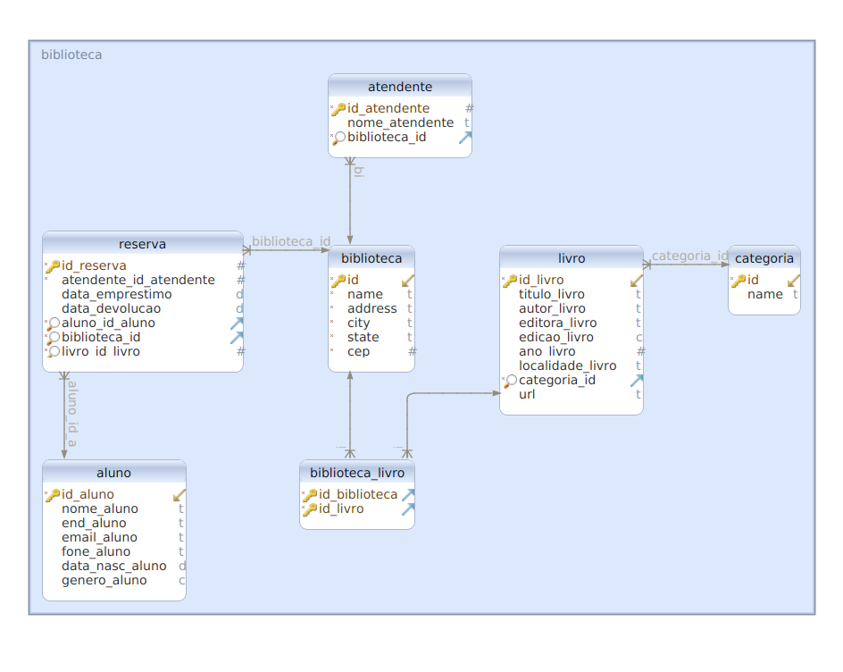
### Há um arquivo .uml e dmm para importar em "bd/\*.uml" "bd/\*.dmm"

# Pre requisitos
+ PHP 
    + Windows
        + Wampserver
        + Xampp
    + Linux 
        + install php-7.4+
        + install modulo ```php{version}-mysqli```
        + install MariaDB/MySQL
+ Um navegador atualizado

# Configurações
+ Crie um banco no seu SGBD
+ altere as configurações do arquivo `config.php`
    + `{HOST_NAME}` = Host do bd
    + `{USER_NAME}` = Usuário do bd
    + `{PASS_USER}` = Senha do usuário
    + `{BASE_NAME}` = Nome do Banco

    ```php  
    [...]

    define('HOST', '{HOST_NAME}');
    define('USER', '{USER_NAME}');
    define('PASS', '{PASS_USER}');
    define('BASE', '{BASE_NAME}');
    
    [...]

    ```
# MER/DER
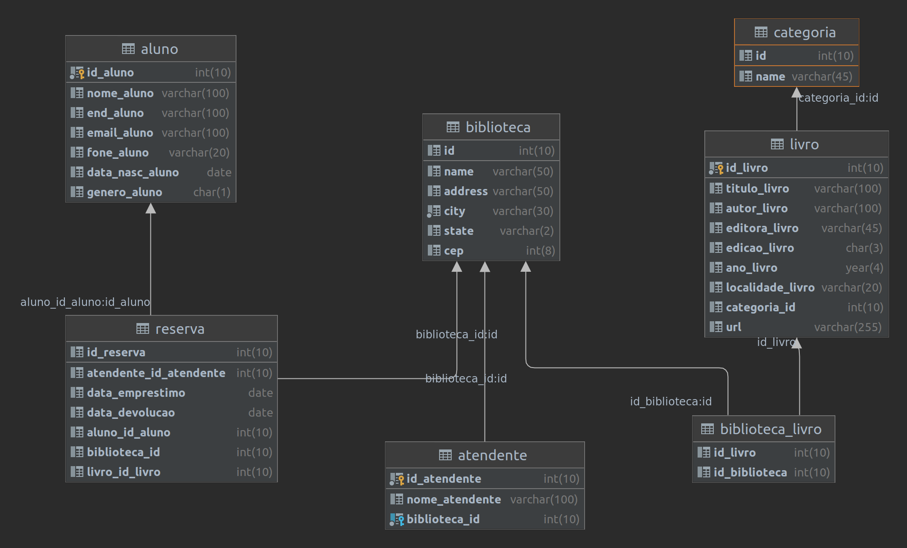

# Menu Princial
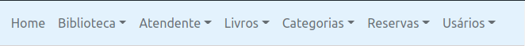

# Index
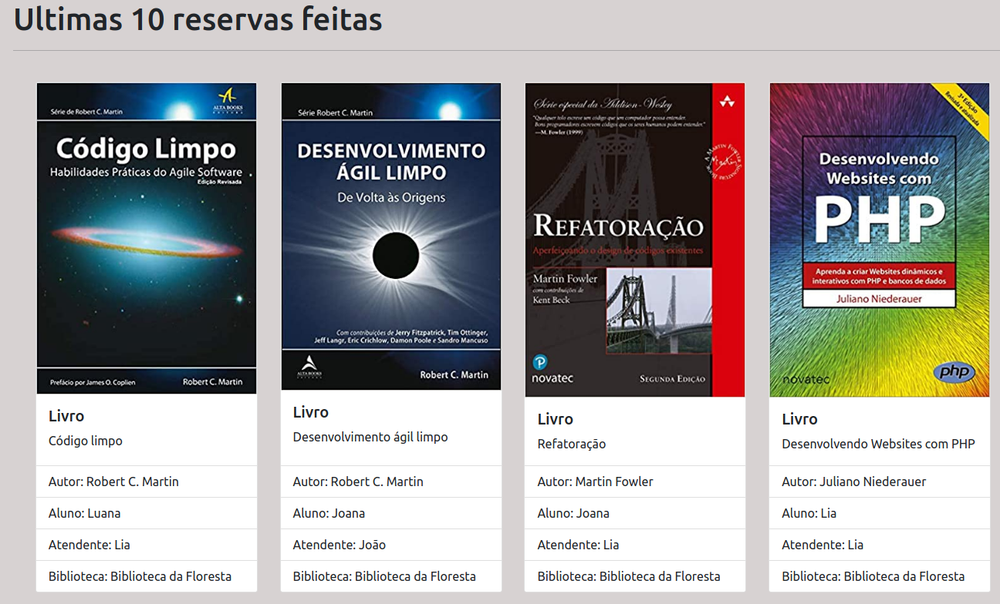

# Bibliotecas

## Cadastro
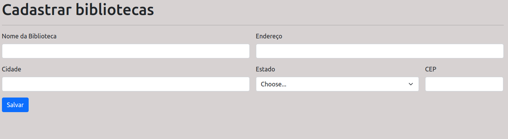
## Lista
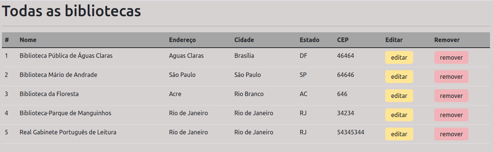


# Atendentes

## Cadastro
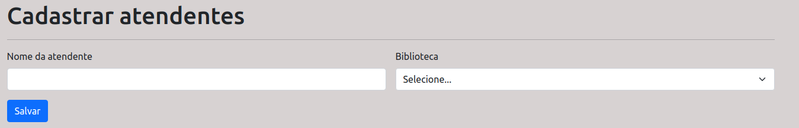
## Lista
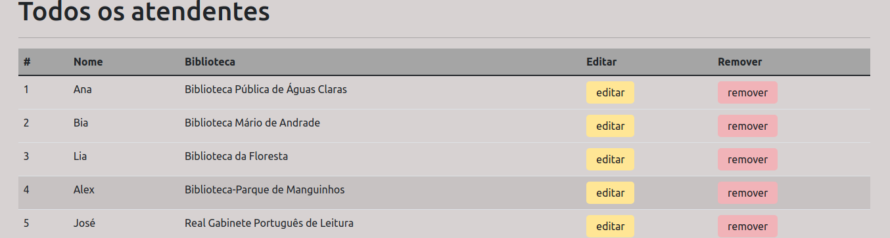

# Livros
## Cadastro
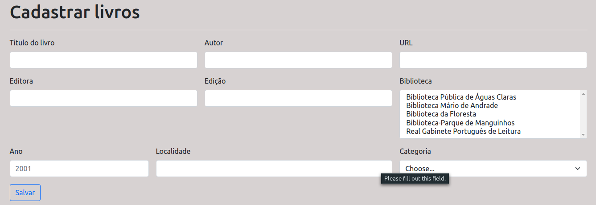
## Lista
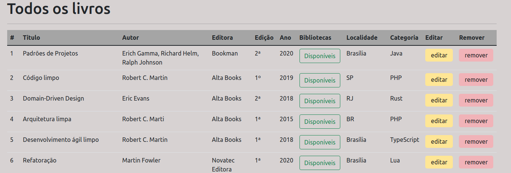

## Botão "Disponveis", para ver as bibliotecas que contém o livro
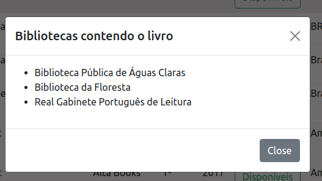

# Categorias
## Cadastro
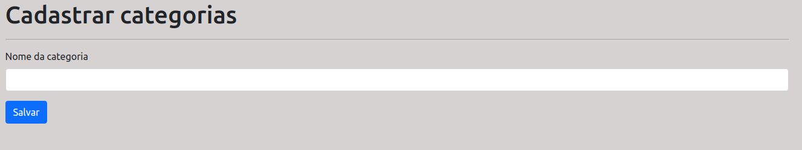
## Lista
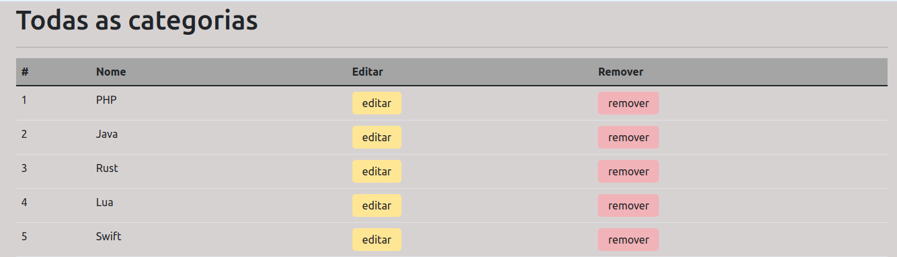

# Reservas
## Cadastro
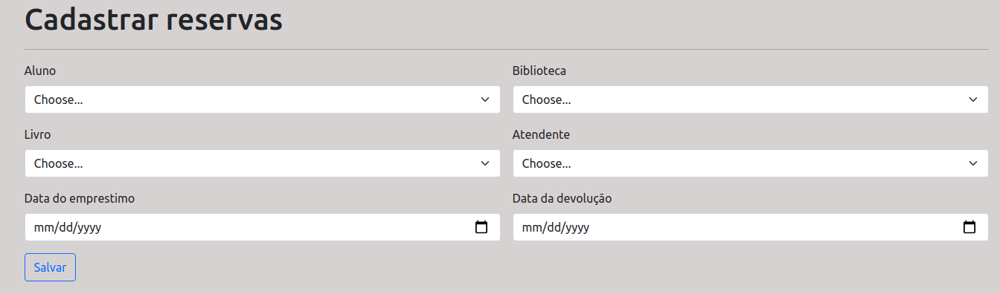
## Lista


# Usuários
## Cadastro
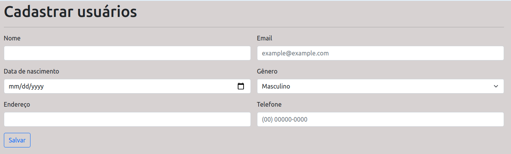
## Lista
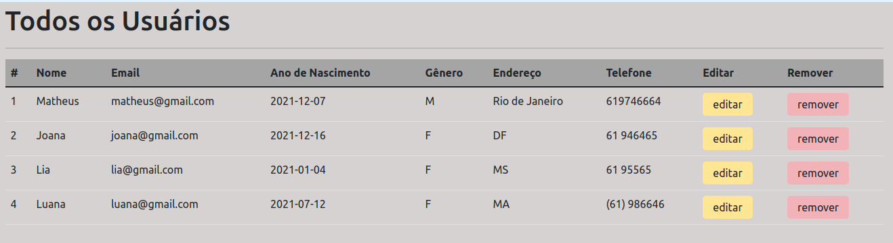